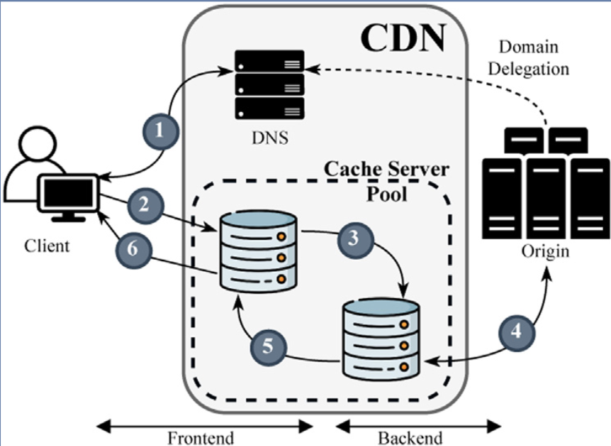
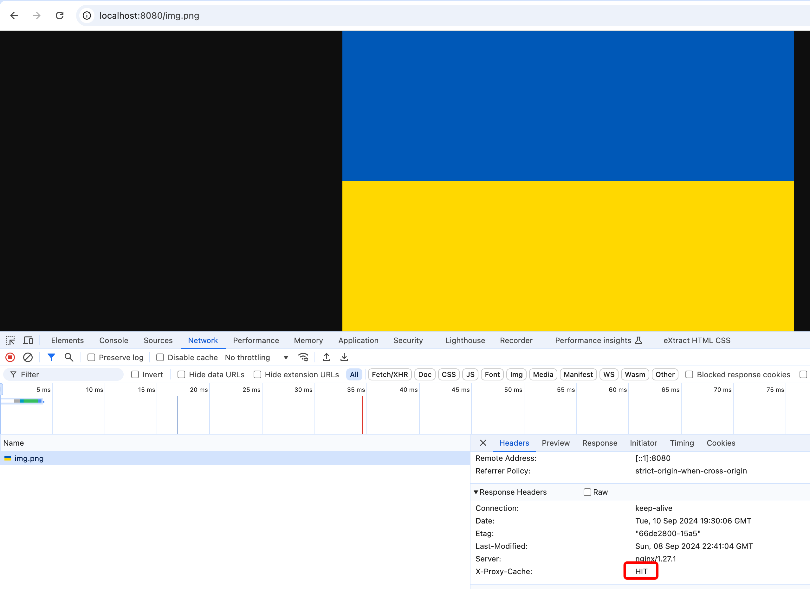
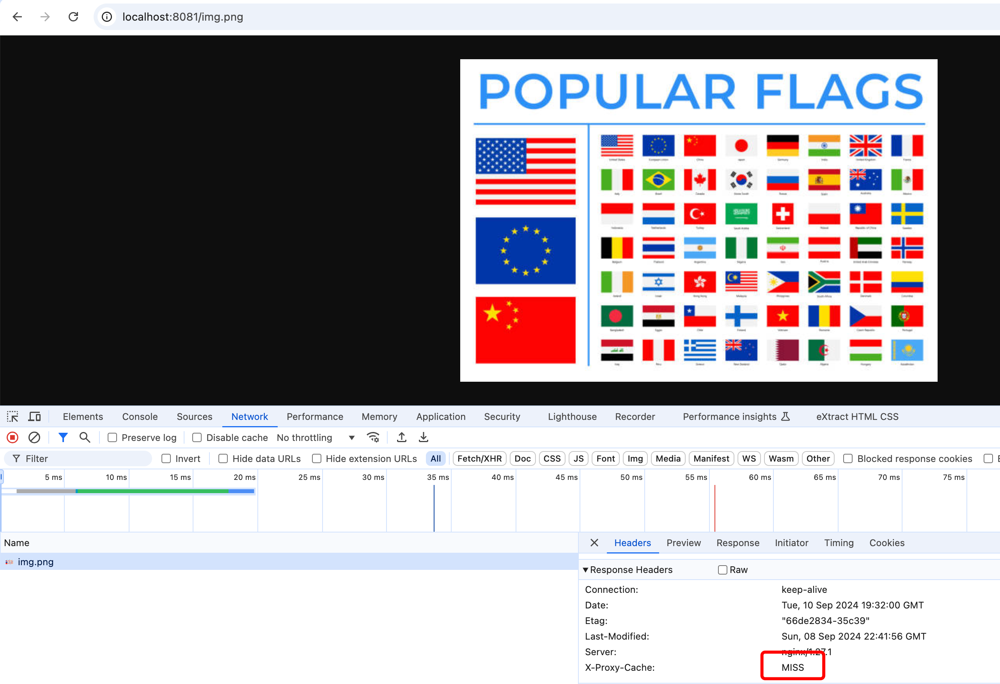

# Custom CDN (Content Delivery Network)

### Description
CDN (Content Delivery Network) that consists of 
- a DNS (bind)
- two Load Balancers (nginx) - load_balancer_1 handles requests from UA region, load_balancer_2 handles requests from the rest of the world
- four Servers (nginx) - two servers per each LB
- two nginx client-servers for testing inside Docker

Testing depending on the region is simulated by adding a special configuration for bind DNS.

### Demo
- Start the containers (`docker-compose up -d`)
- Go to `localhost:8080/img.png` for testing UA region and obtain corresponding picture. After second time requested - a cached image will be retrieved (HIT). Screenshot example for second request:

- Go to `localhost:8081/img.png` for testing non-UA region and obtain corresponding picture. After second time requested - a cached image will be retrieved (HIT). Screenshot example for first request:

- We can see in the logs in the nginx servers which server processed the request

1. `#least_conn;`
This is a load balancing method in NGINX that selects the server with the fewest active connections at the moment a new request arrives.
2. `#ip_hash;`
This is another load balancing method that makes routing decisions based on the client's IP address. The same client IP will always be directed to the same upstream server, ensuring session persistence (useful when sticky sessions are required).